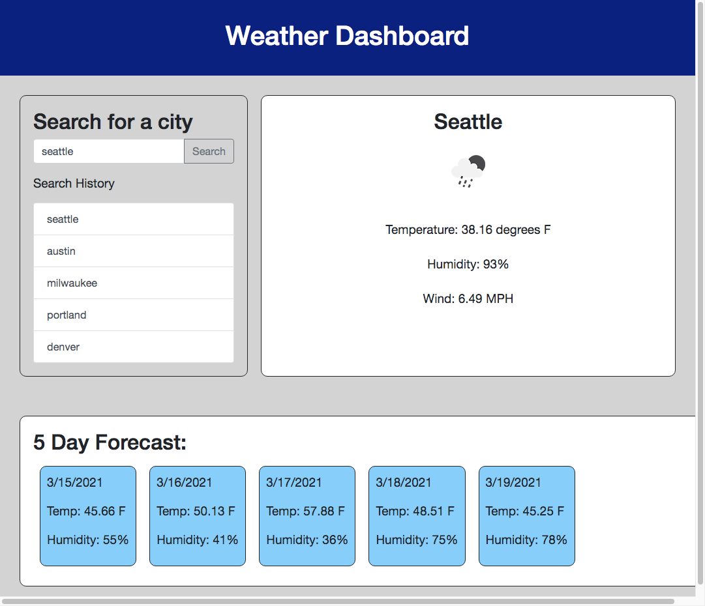

# Weather Dashboard Assignment

## Description
The goal of this project was to create a weather dashboard with the OpenWeather API. After a city is entered, both the current weather and a five day forecast are shown. Recent searches are saved to local storage so they can be searched easily. 

## Installation

Visit this link to view the weather dashboard: https://abbeyschu.github.io/homework6_AS/

## Screenshots

## License 

[MIT](https://github.com/abbeyschu/homework6_AS/raw/main/assets/license.txt)